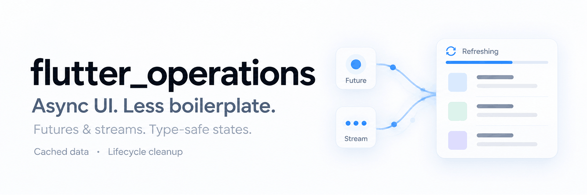

# Flutter Operations

[](https://pub.dev/packages/flutter_operations)
[](https://opensource.org/license/bsd-3-clause)



Type-safe state for asynchronous work in Flutter.

`flutter_operations` models each operation as one of four sealed states: idle, loading, success, or error. Use the states directly with any architecture, or add a mixin to a widget for a complete Future or Stream lifecycle with cached data, race protection, callbacks, and automatic cleanup.

```dart
final Widget body = switch (operation) {
  IdleOperation() => const Text('Ready'),
  LoadingOperation(data: null) => const CircularProgressIndicator(),
  LoadingOperation(:final data?) => DataView(data, refreshing: true),
  SuccessOperation(:final data) => DataView(data),
  ErrorOperation(:final message, data: null) => ErrorView(message),
  ErrorOperation(:final message, :final data?) =>
    DataView(data, error: message),
};
```

The compiler checks that every runtime state is handled. Loading and error states can retain the last successful value, so refreshes and temporary failures do not need to blank the screen.

This package grew from [Exhaustive Pattern Matching for Exhausted Flutter Developers](https://medium.com/@saadoardati/exhaustive-pattern-matching-for-exhausted-flutter-developers-cd6837459862).

## Why use it?

A Future or Stream is rarely only "loading" or "done." Real interfaces need to distinguish:

- waiting for the user to start an action;
- loading without data;
- refreshing while old data remains visible;
- success with a required, nullable, or intentionally absent result;
- failure without data;
- failure while cached data remains usable.

Loose `isLoading`, `data`, and `error` fields can represent contradictory combinations. `OperationState<T>` cannot. Its sealed hierarchy gives each combination a name and lets Dart verify exhaustive switches.

The package is useful at two levels:

1. **Use `OperationState<T>` by itself.** It is a small immutable state model that works in Cubit, BLoC, Riverpod, Provider, ChangeNotifier, controllers, reducers, tests, or plain Dart classes.
2. **Use a widget mixin.** `AsyncOperationMixin` and `StreamOperationMixin` own the lifecycle when an operation belongs to one `StatefulWidget` and a larger state-management layer would add ceremony without value.

It is not a replacement for application architecture. It is a focused operation model that fits inside the architecture you already use.

## Install

```yaml
dependencies:
  flutter_operations: ^3.0.0
```

```dart
import 'package:flutter_operations/flutter_operations.dart';
```

### Install the agent skill

Install the optional skill for Claude Code, Codex, Cursor, Gemini CLI, and other supported agents:

```bash
npx skills add SaadArdati/flutter_operations --skill flutter-operations
```

Add `-g` for a global installation.

For Claude Code, install the plugin in one step from inside a session:

```text
/plugin install flutter-operations --marketplace SaadArdati/flutter_operations
```

Or from your terminal:

```bash
claude plugin marketplace add SaadArdati/flutter_operations
claude plugin install flutter-operations@flutter-operations
```

## The four states

| State | Meaning | Data |
|---|---|---|
| `IdleOperation<T>` | Ready, but not actively running | Optional cached `T` |
| `LoadingOperation<T>` | Work is in progress | Optional cached `T` |
| `SuccessOperation<T>` | Work completed successfully | Required `T` |
| `ErrorOperation<T>` | Work failed | Optional cached `T`, message, error, and stack trace |

`IdleOperation<T>` extends `LoadingOperation<T>`. A `LoadingOperation()` pattern therefore matches both unless `IdleOperation()` appears first. This is intentional: screens that render idle and loading identically need only one arm.

### Choose an honest result type

The success payload is exactly `T`.

```dart
OperationState<User>   // Every success contains a User.
OperationState<User?>  // A successful lookup may contain no User.
OperationState<void>   // The command succeeds without a meaningful value.
```

`SuccessOperation<User>.data` is `User`. It does not return `User?` and does not throw. For delete, logout, save, confirmation, and other command-style operations, use `void`:

```dart
final state = const SuccessOperation<void>(data: null, message: 'Deleted');
```

## Use case 1: Own a Future inside a widget

Use `AsyncOperationMixin` for a request, database read, computation, permission check, command, or any other one-shot operation tied to a widget lifecycle.

```dart
class _ProfilePageState extends State<ProfilePage>
    with AsyncOperationMixin<User, ProfilePage> {
  @override
  Future<User> fetch() => repository.fetchUser(widget.userId);

  @override
  Widget build(BuildContext context) {
    return ValueListenableBuilder(
      valueListenable: operationNotifier,
      builder: (context, operation, _) => switch (operation) {
        LoadingOperation(data: null) =>
          const Center(child: CircularProgressIndicator()),
        ErrorOperation(:final message, data: null) => ErrorView(
          message: message ?? 'Could not load the profile',
          onRetry: reload,
        ),
        LoadingOperation(:final data?) ||
        ErrorOperation(:final data?) ||
        SuccessOperation(:final data) => RefreshIndicator(
          onRefresh: reload,
          child: ProfileView(user: data),
        ),
      },
    );
  }
}
```

By default, `loadOnInit` is `true`. The mixin:

- starts in `LoadingOperation` and calls `fetch()` after initialization;
- publishes `SuccessOperation<T>` or `ErrorOperation<T>`;
- preserves cached data during reloads and failures by default;
- ignores stale completions when a newer load starts;
- ignores completions after disposal;
- exposes lifecycle callbacks without requiring them.

### Wait for user input

Search, confirmation, and permission flows often should not start immediately. Return `false` from `loadOnInit` to begin in `IdleOperation`.

```dart
class _SearchPageState extends State<SearchPage>
    with AsyncOperationMixin<List<Result>, SearchPage> {
  @override
  bool get loadOnInit => false;

  String query = '';

  @override
  Future<List<Result>> fetch() => api.search(query);

  void search(String value) {
    query = value;
    load(cached: false);
  }

  @override
  Widget build(BuildContext context) => switch (operation) {
    IdleOperation() => SearchPrompt(onSubmitted: search),
    LoadingOperation() => const CircularProgressIndicator(),
    SuccessOperation(:final data) => SearchResults(data),
    ErrorOperation(:final message) => ErrorView(message: message),
  };
}
```

Call `setIdle()` whenever the operation should return to a ready state. `setIdle(cached: true)` keeps existing data; `setIdle(cached: false)` clears it.

## Use case 2: Own a Stream inside a widget

Use `StreamOperationMixin` for database snapshots, WebSockets, connectivity, location, sensors, or any source that can emit more than once.

```dart
class _ChatPageState extends State<ChatPage>
    with StreamOperationMixin<List<Message>, ChatPage> {
  @override
  Stream<List<Message>> stream() => chatRepository.watchRoom(widget.roomId);

  @override
  Widget build(BuildContext context) {
    return ValueListenableBuilder(
      valueListenable: operationNotifier,
      builder: (context, operation, _) => switch (operation) {
        LoadingOperation(data: null) =>
          const Center(child: CircularProgressIndicator()),
        ErrorOperation(:final message, data: null) =>
          ErrorView(message: message),
        LoadingOperation(:final data?) ||
        ErrorOperation(:final data?) ||
        SuccessOperation(:final data) => MessagesList(data),
      },
    );
  }
}
```

`listenOnInit` defaults to `true`. Set it to `false` to begin idle and call `listen()` later. Calling `listen()` replaces the current subscription and starts a new generation, so late values and errors from an older generation cannot replace current state. The subscription is canceled during disposal.

## Use case 3: Use the states with any state manager

The sealed states do not depend on either mixin. They are useful anywhere an object exposes state.

### Cubit or BLoC

```dart
class UserCubit extends Cubit<OperationState<User>> {
  UserCubit(this.repository) : super(const IdleOperation());

  final UserRepository repository;

  Future<void> load() async {
    emit(state.transitionTo.loading());
    try {
      final user = await repository.fetchUser();
      emit(state.transitionTo.success(data: user));
    } catch (error, stackTrace) {
      emit(state.transitionTo.error(
        message: 'Could not load the user',
        error: error,
        stackTrace: stackTrace,
      ));
    }
  }
}
```

### ChangeNotifier or a plain controller

```dart
class UserController extends ValueNotifier<OperationState<User>> {
  UserController(this.repository) : super(const IdleOperation());

  final UserRepository repository;

  Future<void> load() async {
    value = value.transitionTo.loading();
    try {
      value = value.transitionTo.success(data: await repository.fetchUser());
    } catch (error, stackTrace) {
      value = value.transitionTo.error(
        error: error,
        stackTrace: stackTrace,
      );
    }
  }
}
```

The same state field can live in a Riverpod Notifier, Provider model, reducer, service, or custom controller. State propagation belongs to that architecture; `flutter_operations` supplies the operation semantics.

## Use case 4: Keep content visible during refresh and failure

Cached data is a first-class part of loading and error states.

```dart
Future<void> refresh() async {
  state = state.transitionTo.loading(); // Existing data is preserved.
  try {
    state = state.transitionTo.success(data: await repository.fetchItems());
  } catch (error, stackTrace) {
    state = state.transitionTo.error(
      message: 'Refresh failed',
      error: error,
      stackTrace: stackTrace,
    ); // Existing data is still available.
  }
}
```

This supports stale-while-refresh interfaces without a separate cache field. Pass `data: null` when a transition must deliberately clear cached data:

```dart
state = state.transitionTo.loading(data: null);
```

## Use case 5: Model commands, not only queries

Operations also describe work whose result is completion itself: save, delete, upload, logout, payment confirmation, permission requests, form submission, and navigation prerequisites.

```dart
class _SaveButtonState extends State<SaveButton>
    with AsyncOperationMixin<void, SaveButton> {
  @override
  bool get loadOnInit => false;

  @override
  Future<void> fetch() async {
    await repository.save(widget.draft);
    attachMessage('Saved');
  }

  @override
  Widget build(BuildContext context) {
    return ElevatedButton(
      onPressed: operation.isNotLoading ? load : null,
      child: Text(operation.isLoading ? 'Saving...' : 'Save'),
    );
  }
}
```

Use lifecycle callbacks for side effects such as analytics, snackbars, or coordination with surrounding code:

```dart
@override
void onSuccess(void data) {
  Navigator.of(context).pop(true);
}
```

## Use case 6: Build explicit state transitions

Every state exposes `transitionTo`. Concrete variants expose only other destinations, while an `OperationState<T>` reference exposes all destinations.

```dart
OperationState<User> state = const IdleOperation();

state = state.transitionTo.loading();
state = state.transitionTo.success(data: user, message: 'Loaded');
state = state.transitionTo.error(message: 'Offline', error: networkError);
state = state.transitionTo.idle();
```

Loading, idle, and error transitions preserve current data when `data` is omitted. Passing `data: null` clears it. Success always requires a value satisfying `T`.

Destination availability follows the receiver's static or promoted type:

```dart
if (state case SuccessOperation<User> success) {
  success.transitionTo.loading(); // Available.
  success.transitionTo.error();   // Available.
  // success.transitionTo.success(...) is intentionally unavailable.
}
```

Use `copyWith` when the runtime variant should stay the same:

```dart
final updated = errorState.copyWith(
  message: 'Please try again',
  stackTrace: null,
);
```

Omitted fields are preserved. Explicit `null` clears nullable fields, subject to the selected state's documented type constraints.

## Success messages

`SuccessOperation` can carry an optional message separately from its data.

For an async mixin, call `attachMessage` anywhere inside the active `fetch()` flow, including after an `await`:

```dart
@override
Future<User> fetch() async {
  final response = await api.fetchUser();
  if (response.message case final message?) attachMessage(message);
  return response.user;
}
```

For a stream mixin, call it inside an `async*` body immediately before the corresponding `yield`:

```dart
@override
Stream<Message> stream() async* {
  await for (final event in repository.events()) {
    if (event.message case final message?) attachMessage(message);
    yield event.data;
  }
}
```

The message is scoped to the active `load()` or `listen()` zone. Calls outside that flow are no-ops. For manually constructed states, pass `message` directly to `SuccessOperation` or `transitionTo.success`.

## Rendering patterns

### Full detail

Use separate arms when the UI distinguishes initial loading, refresh, terminal failure, and failure with cached content.

```dart
return switch (operation) {
  IdleOperation(data: null) => const StartView(),
  IdleOperation(:final data?) => Preview(data),
  LoadingOperation(data: null) => const LoadingView(),
  LoadingOperation(:final data?) => DataView(data, refreshing: true),
  SuccessOperation(:final data) => DataView(data),
  ErrorOperation(:final message, data: null) => ErrorView(message: message),
  ErrorOperation(:final message, :final data?) =>
    DataView(data, error: message),
};
```

### Data presence only

Use the base type when state identity does not affect rendering.

```dart
return switch (operation) {
  OperationState(:final data?) => DataView(data),
  OperationState() => const LoadingView(),
};
```

### Error first

Put error first when it should override cached-data rendering.

```dart
return switch (operation) {
  ErrorOperation(:final message) => ErrorView(message: message),
  OperationState(:final data?) => DataView(data),
  OperationState() => const LoadingView(),
};
```

### Payload guards

```dart
return switch (operation) {
  SuccessOperation(:final data) when data.isEmpty => const EmptyView(),
  SuccessOperation(:final data) => ResultsView(data),
  LoadingOperation() => const LoadingView(),
  ErrorOperation(:final message) => ErrorView(message: message),
};
```

For small gates, the convenience getters are clearer than a switch:

```dart
ElevatedButton(
  onPressed: operation.isNotLoading ? reload : null,
  child: Text(operation.isLoading ? 'Refreshing...' : 'Refresh'),
);
```

Available getters include `isLoading`, `isIdle`, `isSuccess`, `isError`, their `isNot...` counterparts, `hasData`, `hasNoData`, and `dataOrNull`.

## Mixin reference

| Purpose | Async mixin | Stream mixin |
|---|---|---|
| Source | `fetch()` | `stream()` |
| Start automatically | `loadOnInit` | `listenOnInit` |
| Start or restart | `load()` / `reload()` | `listen()` |
| Publish success manually | `setSuccess()` | `setData()` |
| Success callback | `onSuccess()` | `onData()` |
| Completion callback | Not applicable | `onDone()` |

Both mixins also expose:

- `operation` and `operationNotifier`;
- `setIdle`, `setLoading`, and `setError`;
- `onIdle`, `onLoading`, and `onError`;
- `errorMessage` for display-message formatting;
- `globalRefresh`, which defaults to `false`.

With the default `globalRefresh: false`, rebuild only the listening subtree with `ValueListenableBuilder`. Set it to `true` only when the entire owning widget must rebuild on each transition.

## Scope and trade-offs

Use this package when one operation benefits from explicit lifecycle state and exhaustive handling. It works especially well for:

- page and component data loading;
- pull-to-refresh with cached content;
- search and user-triggered work;
- form submissions and command buttons;
- Firestore, WebSocket, sensor, and connectivity streams;
- local controllers and existing state-management systems;
- tests that need precise operation-state assertions.

Use a larger state machine or orchestration layer when several operations must coordinate atomically, when offline synchronization is the main problem, or when the domain has many states that are not meaningfully idle/loading/success/error. You can still use `OperationState<T>` for individual operations inside that larger model.

## Contributing

Issues and pull requests are welcome at [github.com/SaadArdati/flutter_operations](https://github.com/SaadArdati/flutter_operations).
